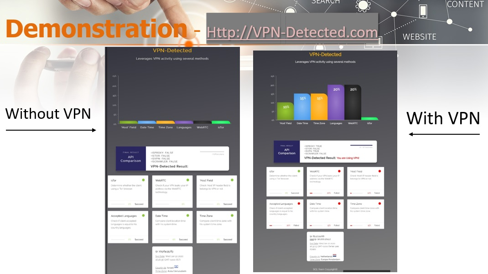

# VPN-Detected
### Introduction
Html Web Server that leverages VPN activity using several methods that<br>
manipulate the IP header fields of the operation request.<br>
Each method checks and increase Percentage if VPN is used and show which of them success and which was failing.

### Build Setup
```javascript
//Clone/Fork the repo

// Go clonned folder
cd VPN-Detected

// Install node modules
npm install

// Run app
node server.js

// Local app should available at http://localhost:3000
```
### NPM Packages
- express
- request
- geoip-lite
- country-language
- body-parser
- ejs


### Demonstration
 > Video Demonstration


### Screenshots
> Introduction


> Explanation


> How Does a VPN Work?


> Why Using VPN?


> VPN Solutions


> Steps


> Tests


> Demonstration

